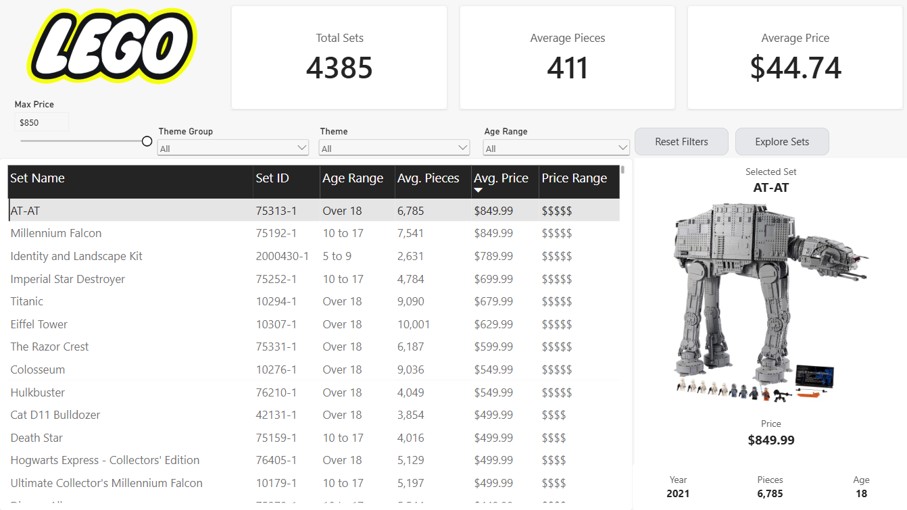
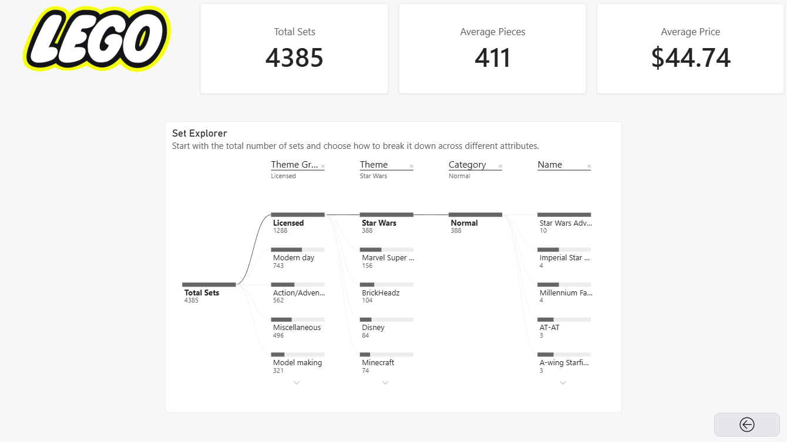

# LEGO Set Explorer — Power BI Dashboard

An interactive Power BI report that helps users discover and explore LEGO sets by theme group, theme, age range, and price.

## Skills Demonstrated

**Power BI:** Power Query · DAX · Data Modeling · Slicers · Parameters · Tooltips · Bookmarks · Decomposition Trees · Interactive Visual Design

## Dashboard

**Main Dashboard**: Allows users to filter LEGO sets. Users can select an individual set to view additional details.

  

 

**Set Explorer Page**: Offers users the use of a decomposition tree to explore the composition of LEGO sets across the attributes--theme group, theme, category, and set name.

  

## Overview

The goal of this project was to build an interactive Power BI report that allows users to explore and discover LEGO sets based on their preferences.

I prepared and profiled the LEGO sets dataset, created calculated columns and DAX measures for key metrics, and designed an interactive report with filters for theme group, theme, age range, and maximum price.

The main LEGO Set Finder page allows users to browse matching sets and inspect detailed information for a selected set, while a supplementary Set Explorer page uses a decomposition tree to explore the composition of LEGO sets across different attributes.

## Key Features

- KPI cards for total sets, average pieces, and average price
- Interactive slicers for theme group, theme, and age range
- Numeric range parameter for maximum price
- Interactive LEGO set search table
- Selected-set detail panel
- Image tooltips for LEGO sets
- Bookmarks and navigation buttons
- Decomposition tree for exploratory analysis
- Cross-filtering and customized visual interactions

## Dataset

The LEGO Sets dataset contains information about LEGO sets released from 1970 to 2022.

The original dataset contains 18,459 records and 14 fields.

For the report, I prepared the data by removing unnecessary fields, filtering out incomplete records, and creating additional categories for age range and price range.

Key fields include:

- Set name
- Set ID
- Theme group
- Theme
- Category
- Year
- Pieces
- Price
- Age

## Project Workflow

1. **Data Preparation** — Loaded and reviewed the LEGO sets dataset and removed unnecessary fields and incomplete records.
2. **Feature Creation** — Created age-range and price-range categories for analysis.
3. **DAX Measures** — Created measures for total sets, total groups, average age, average pieces, and average price.
4. **Report Design** — Designed the LEGO Set Finder page with KPI cards, slicers, a results table, and a selected-set detail section.
5. **Interactivity** — Added a maximum-price parameter, tooltips, bookmarks, navigation buttons, and customized visual interactions.
6. **Exploratory Analysis** — Added a decomposition tree page for exploring the composition of LEGO sets across multiple attributes.

## Files

- `LEGO_Set_Explorer.pbix` — Power BI report containing the complete dashboard, data model, DAX measures, and interactive components.
- `images/lego-set-finder.png` — Preview of the main LEGO Set Finder page.
- `images/set-explorer.png` — Preview of the supplementary Set Explorer page.

## Project Context

Completed as a guided project from Maven Analytics to practice data preparation, DAX, interactive reporting, and dashboard development using Microsoft Power BI.
